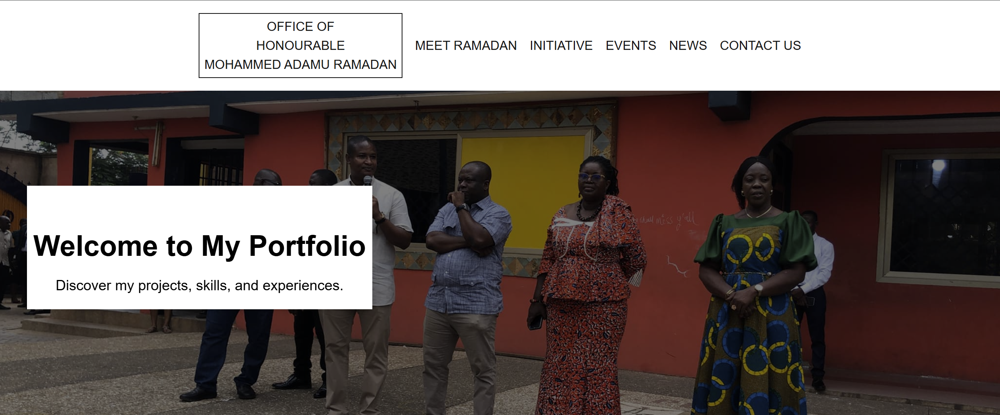

# Ramadan Personal Website 🌙

<p align="center">
  
  
  
  
  
</p>

A modern personal website built with [Next.js](https://nextjs.org/), [Tailwind CSS](https://tailwindcss.com/), and [TypeScript](https://www.typescriptlang.org/).  
This project showcases my portfolio, initiatives, and personal interests with a responsive, elegant design.

---

## ✨ Features
- ⚡️ Built with Next.js 14 (latest version) for optimal performance.  
- 🎨 Styled with Tailwind CSS for clean and modern UI.  
- 📱 Fully responsive across devices.  
- 🔍 SEO-friendly with metadata and Open Graph support.  
- 🎭 Smooth animations & parallax scrolling sections.  
- 🖼️ Image optimization with Next.js `Image` component.  
- 🔑 Secure authentication-ready structure (optional).  

---

## 📂 Project Structure
```
.
├── README.md
├── Screenshot.png
├── app
│   ├── components
│   │   ├── about-us.tsx
│   │   ├── header.tsx
│   │   ├── horizontal-line.tsx
│   │   ├── initiative-gallery.tsx
│   │   ├── initiative.tsx
│   │   ├── logo.tsx
│   │   ├── nav-link.tsx
│   │   └── navbar.tsx
│   ├── favicon.ico
│   ├── globals.css
│   ├── layout.tsx
│   └── page.tsx
├── eslint.config.mjs
├── next-env.d.ts
├── next.config.ts
├── package-lock.json
├── package.json
├── postcss.config.mjs
├── public
│   ├── about-us.jpg
│   ├── about-us.jpg:Zone.Identifier
│   ├── icons
│   │   ├── android-chrome-192x192.png
│   │   ├── android-chrome-192x192.png:Zone.Identifier
│   │   ├── android-chrome-512x512.png
│   │   ├── android-chrome-512x512.png:Zone.Identifier
│   │   ├── apple-touch-icon.png
│   │   ├── apple-touch-icon.png:Zone.Identifier
│   │   ├── favicon-16x16.png
│   │   ├── favicon-16x16.png:Zone.Identifier
│   │   ├── favicon-32x32.png
│   │   ├── favicon-32x32.png:Zone.Identifier
│   │   ├── favicon.ico
│   │   ├── favicon.ico:Zone.Identifier
│   │   ├── site.webmanifest
│   │   └── site.webmanifest:Zone.Identifier
│   ├── parallax-image.jpg
│   ├── parallax-image.jpg:Zone.Identifier
│   ├── project
│   │   ├── project-1.jpg
│   │   └── project-1.jpg:Zone.Identifier
│   └── slider-image
│       ├── slider-image-1.jpg
│       ├── slider-image-1.jpg:Zone.Identifier
│       ├── slider-image-2.jpg
│       ├── slider-image-2.jpg:Zone.Identifier
│       ├── slider-image-3.jpg
│       └── slider-image-3.jpg:Zone.Identifier
├── tree
└── tsconfig.json

7 directories, 48 files

```


---

## 🚀 Getting Started

### 1️⃣ Clone the repository
```bash
git clone git@github.com:chrispydev/ramadan-personal-website.git
cd ramadan-personal-website
```


## 2️⃣ Install dependencies
```bash
npm install
# or
yarn install
# or
pnpm install
```

## 3️⃣ Run the development server
```bash
npm run dev
```

## 🛠️ Tech Stack

- Framework: Next.js 14

- Styling: Tailwind CSS

- Language: TypeScript

- Version Control: Git & GitHub

## 📸 Screenshots



## 🌐 Deployment

This project is optimized for deployment on:

- Vercel (recommended)

- Netlify

- Any Node.js hosting provider

## 👨‍💻 Author

- Christian Yaw Owusu (chrispydev)

- GitHub: @chrispydev

- Email: christianowusu44@gmail.com